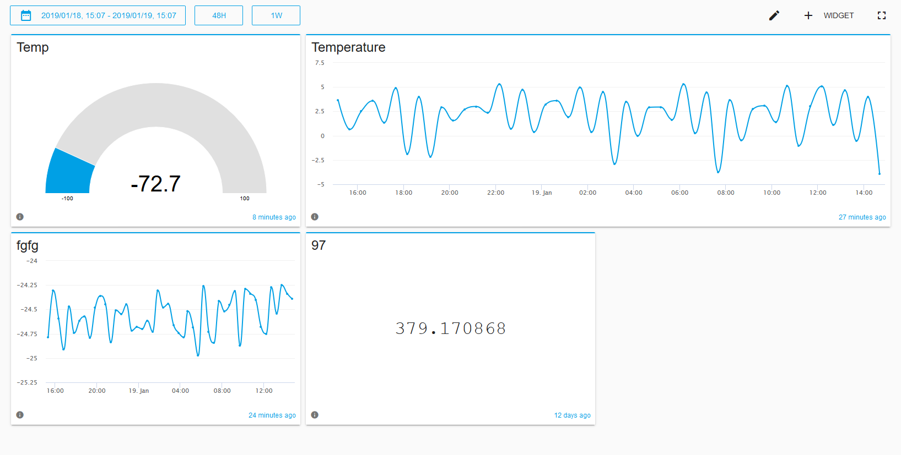

# Dashboard

Dashboards are used to visualize data from devices connected to the cloud platform. Below is an illustration showing a dashboard that displays the temperature of a freezer.

## Create dashboard

Creating a dashboard is accomplished by clicking the "new dashboard" button in the menu to the left.

## Deleting a dashboard

::: tip Deleting a dashboard
Deleting a dashboard is permanenet. However, no measurement data is removed.
:::

Deleting a dashboard is accomplished by

* Select a dashboard from the side menu
* Click the pencil that appears inside the button
* Click the `Delete` button inside the popup 

## Edit a dashboard

Edit a dashboard is done by

* Select a dashboard from the side menu
* Click the pencil inside the selected dashboard button
* Edit the details in the popup and click `save`

## Adding widgets to a dashboard

Adding a widget is accomplisged by

* Click the `+ Widget` button.
* Input a widget name in the label field. For example, temperature in the garage.
* Choose a widget type. Availible options are LED, Gauge, Timeseries and Value.
* Choose a thingtype, followed by a thing and a resource. 
* Click `Save`.

## Deleting widgets from a dashboard

::: tip Deleting a widget
Deleting a widget is permanenet, but no measurement data is removed.
:::

Click the pencil next to the `+ WIDGET` button.

Click on the three dots that appeared inside the widget you want to delete. This brings forward a dropdown menu.

Click the `delete` button.

## Moving widgets

::: tip Click save
Remember to click the `save` button when you are done moving widgets. This button is shaped like a drive and located in the top menu, above all the widgets.
:::

* Click the pencil located in the top menu, above all the widgets in the dashboard
* Click and hold the desired widget. The widget is now moveable.
* Drag the widget to its new location.

* Click save (disk drive), when you are satisfied with the new location.

## Resizing widgets

* Click the pencil in the top right menu. 
* Located in the bottom left corner of the widgets, is a small button, which can be used to resize the widget.
* Click the button and drag the widget into it's new size.