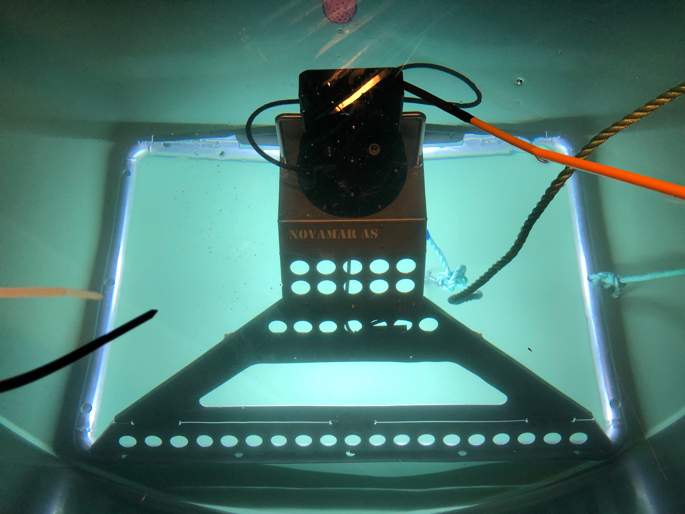

# Introduction

The Sea-bed camera is a specialized type of equipment used to perform environmental surveys of the bottom of the sea. This documentation describes assembly and disassembly of the rig and the usage of the camera control software.

Specifications:
* Maximum depth: 250 meters
* Area: 1m^2
* Height:
* Width:
* Length: 