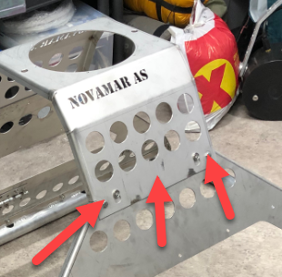
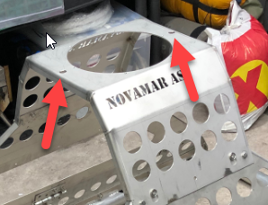
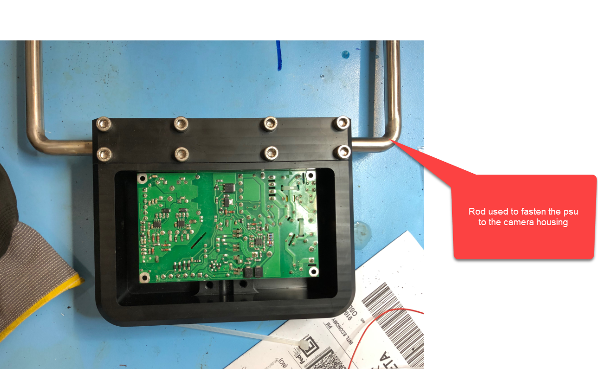

# Mounting

This chapter describes how to assemble and disassemble the rig. Pay attention to the different warnings listed.

Required tools:
* 10 mm wrench
* 19 mm wrench

## Assembly

1. The first step is to attach the camera housing to the bottom frame. Support the walls by standing in the center of the frame and attach the housing to the frame. Pay attention to the warning below.

::: danger Careful with the glass dome
The glass dome is very fragile. Be careful when handling the top to avoid any damage to the glass.
:::

2. Attach the four red hinges at both side of the frame using a 10 mm wrench.

3. Attach the power supply to the camera housing. Then fasten the power supply using two nuts, one at each rod. These nuts are tightened using the 19 mm wrench.

4. Connect the two cables from the power supply to the top of the camera housing.

5. Attach the two cables from the lights.

6. Attach the power cable from the camera rig to the pelicase and power the pelicase with 220 VAC.

7. Turn on the circuit breaker located in the pelicase.

## Disassembly

This section describes the disassembly procedures. 

1. Turn off the circuit breaker in the pelicase and disconnect the power cable to the rig.

::: danger Disconnect power
Remove all power from the system before continuing with the procedure to avoid any damage.
:::

2. Disconnect the two cables going from the power supply to the top of the camera housing. The next step is to detach the power supply from the camera housing. Start by unscrewing the two nuts holding the power supply rods in place. After the nuts are removed, gently remove the power supply. Some pressure might be needed to get the rods through the holes.

3. The second step is to unscrew the four red hinges at each side of the rig. To loosen the hinges, hold the handle in place and twist counter clockwise with a 10 mm wrench on the nuts. The handles should loose easily.

4. Disconnect the cables to both lights and wrap the connectors in a plastic bag to keep them protected. 

5. Remove the top from the bottom frame. Pay attention to the warning below.

::: danger Careful with the glass dome
The glass dome is very fragile. Be careful when handling the top to avoid any damage to the glass.
:::

## Maintenance

::: tip Avoid water entering connectors
Remember to lubricate the connectors with silicon at regular intervals to avoid sea water corroding the connector pins.
:::

::: tip Clean the glass dome
Clean the glass dome with specialized lense cleaner to keep the lense clean without scratching the glass.
:::

::: danger Do not open camera housing
Opening the camera housing voids warranty.
:::