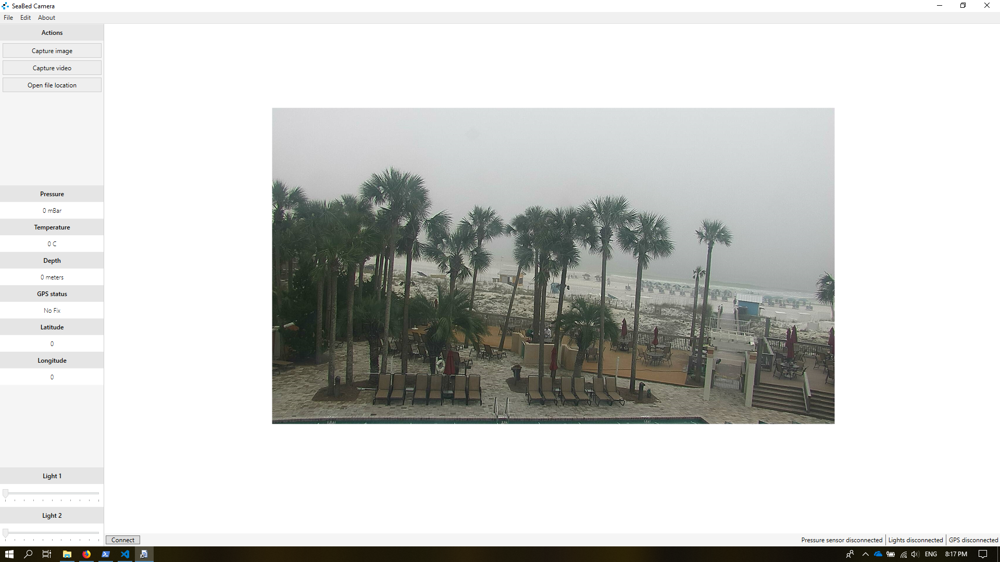

# Software

This chapter describes the usage of the camera control software

## Starting the program

Start the program by clicking the "SeaBed camera" shortcut located at the desktop, or search for the program in the start menu. 

When the program is started, it tries to connect to the camera, pressure sensor, lights and the attached GPS. This may take some time, especially the camera is a bit slow to start. Please wait for about two minutes, and click the connect button if the video feed is not displaying correctly.

The status line at the bottom of the program gives information about the state of the pressure sensor, lights and the GPS. Click connect if they are still disconnected after two minutes has passed.

::: tip Overlay
Information about depth, pressure, gps coordinates and the current time is overlaid onto the captured files.
:::

## Sidebar

The sidebar displays metadata from all the peripherals connected to the system. In addition, video and images are captured from the top section and the two light sources are controlled from the bottom section.

## Capture video

Capturing a video is done by clicking the capture video button located in the top section of the sidebar. The button text is changed to "stop" when the video is capturing. 

Click the button again to stop the video capturing process. 

::: danger Click stop
Remember to click stop before exiting the program or the video will be corrupted.
:::

## Capture photo

Capturing a photo is done by clicking the capture image button in the top section of the sidebar.

## Opening saved files

Find the captured images and videos by clicking the "open file location" button located in the top section of the sidebar.

The files are organized into year/month/date/(movies/pictures)

## Program settings

The program settings allow users to change the COM ports used for the different peripherals. The default configuration should work out of the box.

